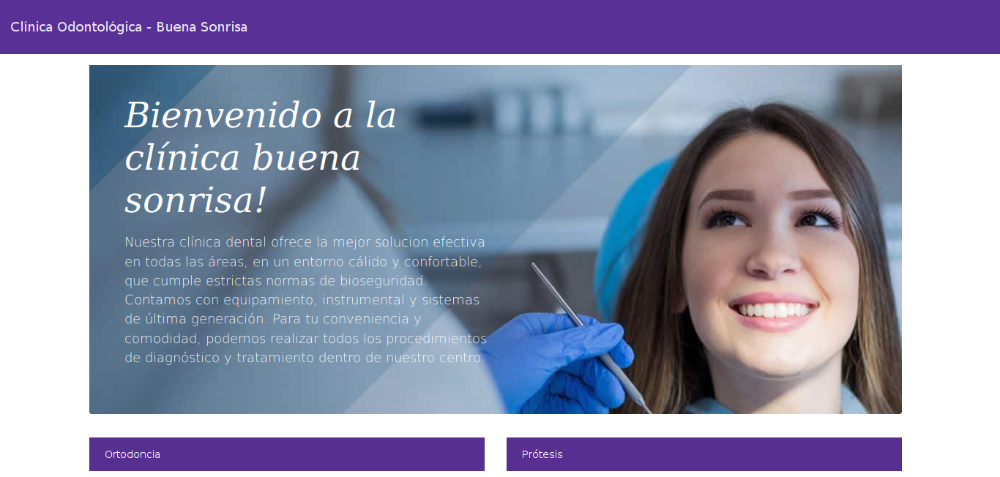
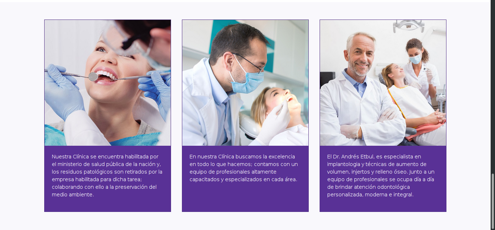
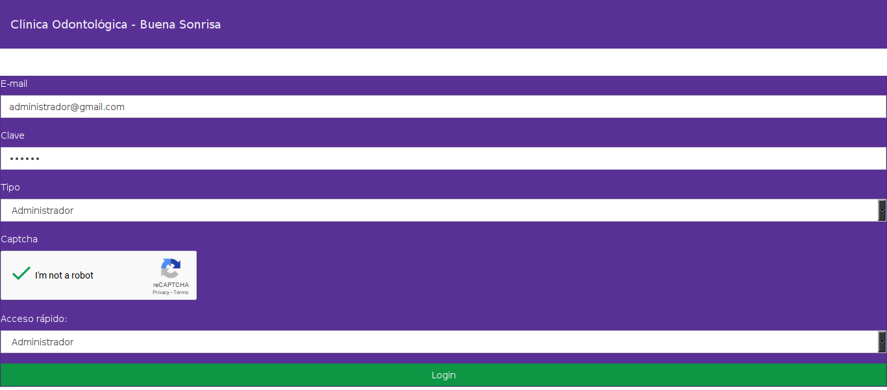
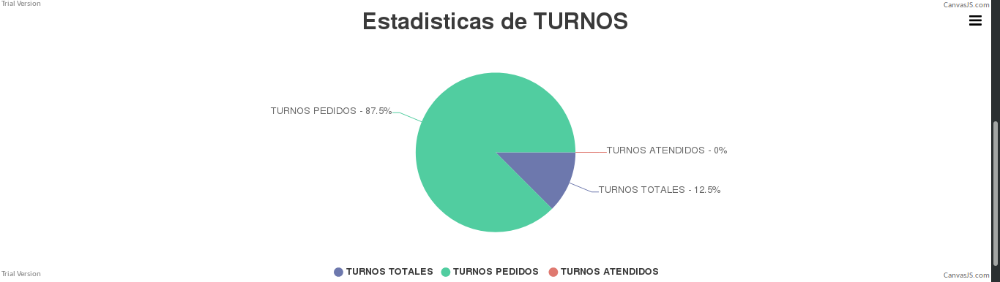
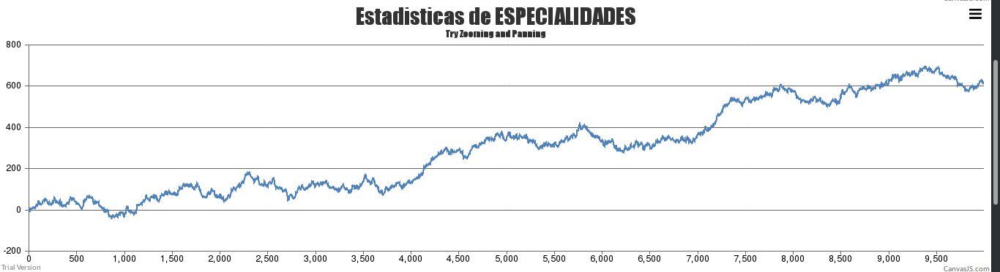
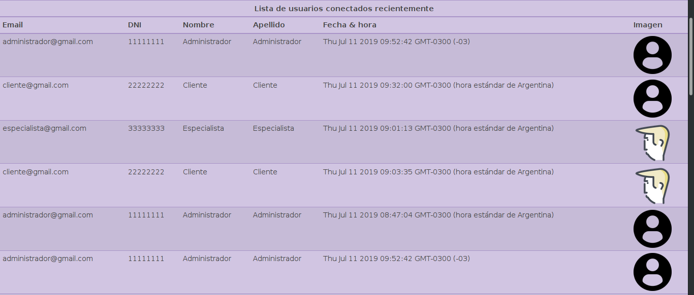
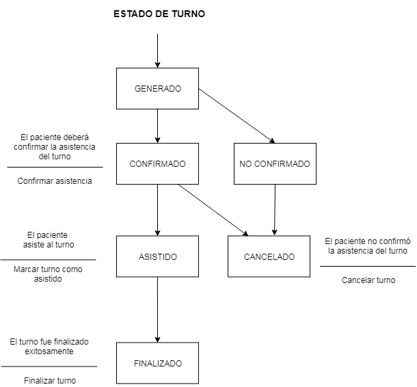

<h1 align="center">Clínica Odontólogica - Buena Sonrisa</h1><h4 align="center">

<h1 align="center">Acceder al sistema   https://tpfigueiras.firebaseapp.com</h1><h4 align="center">

# Profesores:
#  [Octavio Villegas](https://github.com/octaviovillegas) 
#  [Matías Mirotta](https://github.com/mmirotta)

## Objetivo del sistema:

El nuevo sistema de manejo de flujos de pacientes permitirá optimizar los tiempos operativos del área de la recepción del consultorio. El objetivo principal es perfeccionar la gestión de turnos, el manejo de datos de pacientes y colaboradores de la clínica, así como las tareas del personal médico. Adicionalmente se dispondrá de herramientas estadísticas que verificarán la satisfacción de la clientela y empleados.

## Herramientas utilizadas:

- [Firebase](https://firebase.google.com) 
- [Bootstrap + Bootswatch](https://getbootstrap.com/) 
- [ng-bootstrap](https://valor-software.com/ngx-bootstrap/) 
- [ngx-spinner](https://www.npmjs.com/package/ngx-spinner) 
- [ngx-captcha](https://www.npmjs.com/package/ngx-captcha) 
- [Canvas-JS](https://canvasjs.com/) 
- [GIMP](https://www.gimp.org/) 

## Imágenes dentro del sistema:

#

#

#

#

#

## DTE Turnos:

